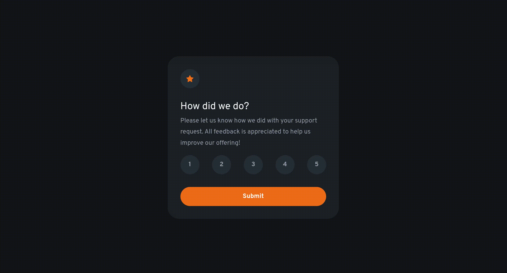

# Frontend Mentor - Interactive rating component solution

This is a solution to the [Interactive rating component challenge on Frontend Mentor](https://www.frontendmentor.io/challenges/interactive-rating-component-koxpeBUmI). Frontend Mentor challenges help you improve your coding skills by building realistic projects. 

## Table of contents

- [Overview](#overview)
  - [The challenge](#the-challenge)
  - [My solution](#my-solution)
  - [Screen Capture](#screen-capture)
- [My process](#my-process)
  - [Built with](#built-with)
  - [What I learned](#what-i-learned)
  - [Continued development](#continued-development)
  - [Useful resources](#useful-resources)
- [Author](#author)
- [Acknowledgments](#acknowledgments)

## Overview

### The challenge

Users should be able to:

- View the optimal layout for the app depending on their device's screen size
- See hover states for all interactive elements on the page
- Select and submit a number rating
- See the "Thank you" card state after submitting a rating

### My Solution
**[View live solution hosted on GitHub Pages](https://jordanhailey.github.io/frontend-mentor--interactive-rating-component/)**.

### Screen Capture

> **Screen Capture Description**: 
> 
> A GIF of my solution, where users can see that the number and submit buttons have distinct `hover` and `active` states. 
> 
> Upon clicking submit, the app hides the "Form" and shows the "Thank You" message. 
> 
> I also added a "Reset State" button to the page to allow the user to revert back to the default state.

## My process

### Built with

- HTML
- CSS
- JavaScript

### What I learned

Usibng utility classes when writing CSS is super handy, but they add a lot of mental overhead when jumping between HTML and CSS editing.

### Continued development

I'm a bit shakey when it comes to my CSS, and this was my first attempt at implementing the *CUBE CSS* methodology. I feel I didn't do a great job being consistent with using utility classes, this would be something I would like to improve upon.

The transition between views is also very basic (`display:none` -> `display:block` and vice versa), it might be nice to add a CSS animation of some sort to make the transition feel more natural.

### Useful resources
- [CUBE CSS](https://cube.fyi/)

## Author

- Website - [Jordan Hailey](https://jordanhailey.com)
- Frontend Mentor - [@jordanhailey](https://www.frontendmentor.io/profile/jordanhailey)

## Acknowledgments

Props to Andy Bell for the nice write up on CUBE CSS.